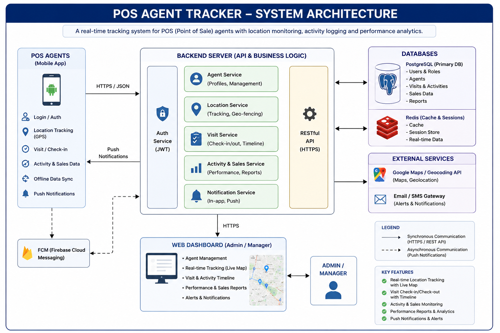

# 💳 POS Agent Financial Tracker System

### Financial Tracking and Tax-Ready Reporting App for POS Agents and Small Businesses


---

## 📌 Project Overview

The **POS Agent Financial Tracker System** is a fintech support application developed to help **POS agents, mobile money operators, and small business owners** improve financial accountability through structured transaction tracking and reporting.

The system records business transactions, calculates service charges automatically, monitors financial performance, and generates reports that support auditing and tax readiness.

This project focuses on improving transparency, accountability, and business management for operators within the informal financial sector.

---

## 🌍 Problem Statement

Many POS agents and small businesses experience challenges such as:

- Poor transaction record keeping
- Difficulty tracking daily profit
- Inaccurate cash flow monitoring
- Missing financial records during auditing
- Lack of tax-ready reporting systems
- Manual calculations leading to errors

These challenges can result in financial leakage, poor decision-making, and business inefficiency.

---

## 💡 Solution

The **POS Agent Financial Tracker System** provides a structured digital solution to:

✅ Record deposits and withdrawals

✅ Automatically calculate transaction charges

✅ Monitor daily and monthly financial performance

✅ Maintain organized financial records

✅ Generate exportable reports for auditing and tax analysis

✅ Improve business accountability and financial visibility

---

## 🎯 Project Objectives

This project was designed to:

- Track **cash inflow (deposits)** and **cash outflow (withdrawals)**
- Automatically compute service charges
- Calculate transaction profit
- Monitor business cash balance
- Support financial reporting
- Improve business accountability for POS operators

---

## ⚙️ Core Features

### ✅ Transaction Recording

Stores transaction details including:

- Transaction type
- Transaction amount
- Date and time
- Service charges
- Profit earned

All data is securely stored using a **SQLite database (`pos_agent.db`)**.

---

### 💰 Automatic Charge Calculation

Transaction charges are calculated automatically based on transaction amount.

| Transaction Amount | Charge |
|--------------------|---------|
| ₦1,000 – ₦9,999 | ₦100 |
| ₦10,000 – ₦19,999 | ₦200 |

This reduces manual errors and improves consistency.

---

### 📊 Financial Summaries

The system provides:

### Daily Summary
- Total Deposits
- Total Withdrawals
- Charges Earned
- Profit Generated
- Business Cash Position

### Monthly Summary
Aggregated reports for:

- Total Transactions
- Total Charges
- Monthly Profit
- Business Performance Overview

---

### 💾 Export Reports

Generate exportable reports in **CSV format** for:

- Auditing
- Business tracking
- Record keeping
- Tax preparation
- Financial analysis

Example report formats:

```text
Daily_Report_YYYY-MM-DD.csv
Monthly_Report_YYYY-MM.csv
```

---

## 🧩 System Workflow

### Application Flow

```text
User
   ↓
GUI Interface
   ↓
Transaction Processing
   ↓
SQLite Database Storage
   ↓
Automatic Calculations
   ↓
Daily/Monthly Summaries
   ↓
CSV Report Export
```

---
## 🏗️ System Architecture

The diagram below illustrates the architecture and operational flow of the POS Agent Financial Tracker System.

<p align="center">
  
</p>
### Architecture Components

### 1. User Interface Layer

Provides a simple interface for users to:

- Add transactions
- View reports
- Monitor business records

Implemented using:

```text
gui_app.py
```

---

### 2. Business Logic Layer

Handles:

- Charge calculations
- Profit computation
- Financial summaries

Implemented using:

```text
calculations.py
```

---

### 3. Database Layer

Responsible for:

- Storing transactions
- Maintaining persistent records
- Data retrieval

Implemented using:

```text
database.py
```

Database technology:

```text
SQLite (pos_agent.db)
```

---

### 4. Reporting Layer

Responsible for:

- Daily reports
- Monthly reports
- CSV export functionality

Implemented using:

```text
reports.py
```

---

## 📂 Project Structure

```text
POS-Agent-Tracker/
│── app.py
│── gui_app.py
│── calculations.py
│── database.py
│── reports.py
│── requirements.txt
│── README.md
│── LICENSE
│
├── assets/
│   └── system architecture png/
│       └── system_architecture.png
│
└── pos_agent.db
```

---

## 💻 Technology Stack

| Category | Technology |
|----------|-------------|
| Programming Language | Python |
| Database | SQLite |
| GUI Framework | Tkinter |
| Data Export | CSV |
| Architecture | Modular Python Design |

---

## 🖼 Application Screenshots

```text
screenshots/main_menu.png
screenshots/add_transaction.png
screenshots/daily_summary.png
screenshots/monthly_summary.png
screenshots/export.png
```

---

## 🎬 Demo Video

```text
demo/POS_Tracker_Demo.mp4
```

*(Replace with your actual demo video link if available.)*

---

## 🚀 How to Run the Project

### Step 1: Clone Repository

```bash
git clone https://github.com/mukhtaraabbasglobalent-creator/POS-Agent-Tracker.git
```

### Step 2: Open Project Folder

```bash
cd POS-Agent-Tracker
```

### Step 3: Install Requirements

```bash
pip install -r requirements.txt
```

### Step 4: Run Application

```bash
python gui_app.py
```

---

## 🧪 Example Use Cases

Useful for:

- POS agents
- Mobile money operators
- Small retail businesses
- Informal financial businesses
- Financial record keeping

---

## 📈 Future Enhancements

- ☁️ Cloud-based data storage
- 📄 PDF report generation
- 🤖 AI-powered business insights
- 📱 Mobile application version
- 🔐 Advanced authentication
- 📊 Analytics dashboard

---

## 🔒 Security Considerations

- Local database storage
- Reduced manual errors
- Structured financial records

Future improvements:

- PIN authentication
- Database encryption
- Cloud backup integration

---

## 🌍 Business & Social Impact

### Financial Inclusion
Helping small businesses improve financial organization.

### Business Accountability
Reducing poor financial management.

### Digital Transformation
Encouraging digital financial record keeping.

### Tax Readiness
Helping operators maintain structured records.

---

## 👤 Project Author

**Mukhtar A Abbas Global Ent.**

Focused on:

- Fintech systems
- Cybersecurity learning
- Business technology solutions
- Financial accountability tools

---

## 📜 License

Licensed under the **MIT License**.
